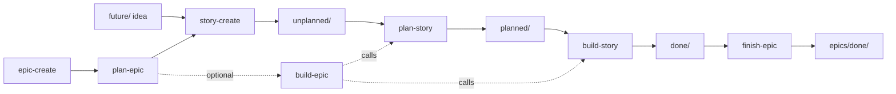

# Kestrel Agent Skills

This folder contains the agent skills used to drive Kestrel's kanban
workflow and a few standalone authoring helpers. Each skill is a single
`SKILL.md` file with YAML frontmatter that the VS Code Copilot agent loads
on demand.

> **Runtime enforcement note.** Frontmatter fields like `allowed-tools` and
> `forbids` are **declarative**: there is no Copilot hook today that
> enforces them at the tool call boundary. They are validated by
> `scripts/lint-skills.sh` (Stage 9) and the agent is expected to honour
> them. Treat them as a contract, not a sandbox.

---

## Skill index

| Skill | Purpose | Inputs |
|-------|---------|--------|
| [epic-create](epic-create/SKILL.md) | Create a new epic in `docs/kanban/epics/unplanned/`. | epic title / description |
| [plan-epic](plan-epic/SKILL.md) | Decompose an epic into ordered unplanned stories. | epic id (`EXX`) |
| [story-create](story-create/SKILL.md) | Create a single story (future or unplanned). | epic id + title |
| [plan-story](plan-story/SKILL.md) | Promote a story from `unplanned/` to `planned/` with an implementation plan. | story id (`S##-##`) |
| [build-story](build-story/SKILL.md) | Execute a planned story to `done/`. | story id (`S##-##`) |
| [build-epic](build-epic/SKILL.md) | Drive every story in an epic through plan + build. | epic id (`EXX`) |
| [finish-epic](finish-epic/SKILL.md) | Verify and close a completed epic. | epic id (`EXX`) |
| [kestrel-stdlib-doc](kestrel-stdlib-doc/SKILL.md) | Improve `.ks` module documentation. *(Standalone — not part of the kanban workflow.)* | module path |

> The `kanban-story-migrate` skill referenced in older docs has been
> **inlined** into `plan-story` (§A) and `build-story` (§B). The standalone
> skill no longer exists.

---

## Workflow graph

---

## Shared assets

These are referenced from multiple skills. Edit here, not in each `SKILL.md`.

| Path | Purpose |
|------|---------|
| [_glossary.md](_glossary.md) | Terms used across skills (epic, tier, gate, etc.). |
| [_templates/](_templates/) | Canonical markdown shapes (epic, story, build notes, commits). |
| [_shared/verify.md](_shared/verify.md) | Test-suite trigger matrix. |
| [_shared/failure-protocol.md](_shared/failure-protocol.md) | What to do when a step fails. |
| [_shared/conventions.md](_shared/conventions.md) | Date sourcing, batching, commit style. |

---

## Verification scripts

| Script | Purpose |
|--------|---------|
| `scripts/check-story.sh <S##-##>` | Validate a story's shape against its current phase. |
| `scripts/check-epic.sh <EXX>` | Validate an epic's closure preconditions. |
| `scripts/lint-skills.sh` | Lint all `SKILL.md` files (frontmatter, refs, templates). |

CI runs `scripts/lint-skills.sh` on every PR touching `.github/skills/**`,
`docs/kanban/**`, or the check scripts.

---

## Authoring a new skill

1. Create `.github/skills/<name>/SKILL.md` with the frontmatter shape from
   [_templates/skill-frontmatter.md](_templates/skill-frontmatter.md).
2. Add the skill to the **Skill index** above.
3. If the skill participates in the kanban workflow, update the **Workflow
   graph** mermaid diagram.
4. Run `scripts/lint-skills.sh` locally.
