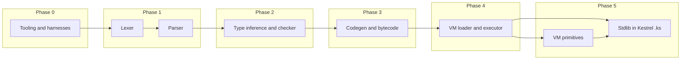

# Kestrel Implementation Plan

Build the compiler (TypeScript), VM (Zig), and standard library piece by piece with full testing at every step: unit tests, integration tests, and end-to-end tests (compile .ks → run on VM, assert output).

**Assumptions (from planning):**
- **1c – Stdlib in Kestrel:** The five stdlib modules and core types (Option, Result, List, Value) are implemented as Kestrel source (`.ks`) that compiles to `.kbc`. The VM exposes only a **minimal set of primitives** (e.g. I/O, low-level string/JSON/HTTP hooks) that stdlib and user code call; the bulk of stdlib behaviour lives in `.ks`.
- **2a – Test harness:** One top-level entry point (`scripts/test-all.sh`) runs unit + integration + E2E in sequence; it must also be possible to run each layer on its own (e.g. `npm test` in compiler, `zig build test` in vm, `./scripts/run-e2e.sh` only).
- **3b – No CI in plan:** Focus on local tooling and test harnesses only; CI can be added later.

---

## Phase 0: Tooling and Test Harnesses

**Goal:** Repo layout, build, and test infrastructure so every later phase can add tests that run in a single suite.

### 0.1 Repository layout

```
kestrel/
  docs/                    # existing specs
  compiler/                # TypeScript compiler
    package.json
    tsconfig.json
    src/
      lexer/
      parser/
      ast/
      types/
      codegen/
      bytecode/
      index.ts
    test/
      unit/
      integration/
      fixtures/
  vm/                      # Zig VM
    build.zig
    src/
      main.zig
      load.zig
      exec.zig
      value.zig
      gc.zig
      primitives/          # Minimal VM primitives called by stdlib (Phase 5)
    test/
      unit/
      integration/
  tests/                   # Cross-cutting E2E and conformance
    e2e/
      scenarios/            # .ks files; expected stdout in-file as // under each print
    conformance/
      parse/valid/
      parse/invalid/
      typecheck/valid/
      typecheck/invalid/
      runtime/
    fixtures/               # Shared .ks modules for tests
  scripts/
    test-all.sh             # Runs compiler unit + integration, VM unit + integration, E2E
    run-e2e.sh              # Compile each scenario, run VM, diff to expected
  stdlib/                   # Kestrel source for standard library (Phase 5)
    kestrel/
      string.ks
      stack.ks
      http.ks
      json.ks
      fs.ks
      option.ks
      result.ks
      list.ks
      value.ks
```

### 0.2 Compiler tooling (TypeScript)

- **compiler/package.json:** Node 18+, TypeScript, build script (`tsc`), test script (`vitest` or `jest`).
- **compiler/tsconfig.json:** Strict mode, target ES2022, outDir `dist/`, include `src/` and `test/`.
- **Test runner:** Single command `npm test` in `compiler/` that:
  - Runs all `test/unit/**/*.test.ts` (unit).
  - Runs all `test/integration/**/*.test.ts` (integration, e.g. parse → AST, typecheck → inferred types, compile → bytecode buffer).
- **Convention:** Unit tests import only the module under test; integration tests may use multiple compiler stages (e.g. `parse(source)` then `typecheck(ast)`).

### 0.3 VM tooling (Zig)

- **vm/build.zig:** Library + executable; `zig build` produces VM binary; `zig build test` runs all VM tests.
- **Test layout:** 
  - `test/unit/`: single-module tests (e.g. value tagging, instruction decode, GC).
  - `test/integration/`: load a minimal .kbc (fixture) and run to completion, check stack/result.
- **Fixture .kbc:** Add a small set of hand-crafted or compiler-generated .kbc files under `vm/test/fixtures/` once the bytecode format is fixed (Phase 3).

### 0.4 E2E test harness

- **Runner:** `scripts/run-e2e.sh` (or Node script `scripts/run-e2e.mjs`):
  1. For each `tests/e2e/scenarios/*.ks`: run compiler to produce `.kbc`.
  2. Run VM with that `.kbc` (stdin optional, configurable).
  3. Capture stdout (and optionally stderr, exit code).
  4. Compare stdout to expected output taken from the scenario file: each line starting with `//` (or `// `) immediately after a `print(...)` is the expected line for that print; multiple consecutive `//` lines after one print allow multi-line expected output. There is no separate `expected/` directory.
- **Integration with “test all”:** `scripts/test-all.sh` runs: `cd compiler && npm test`, `cd vm && zig build test`, then `./scripts/run-e2e.sh`. Exit non-zero if any step fails. Each layer can be run on its own: `cd compiler && npm test`, `cd vm && zig build test`, or `./scripts/run-e2e.sh`.
- **Early E2E:** First E2E tests can be added as soon as the compiler can emit a trivial .kbc and the VM can load and run it (e.g. single RET). Scenarios and expected output grow as features land.

### 0.5 Deliverables and validation

- [x] `compiler/` has `npm run build` and `npm test` (unit + integration placeholders).
- [x] `vm/` has `zig build` and `zig build test` (placeholders).
- [x] `scripts/test-all.sh` runs compiler tests, VM tests, and E2E (E2E can be skipped or no-op until first scenario exists); each layer can also be run independently.

---

## Phase 1: Lexer and Parser

**Goal:** Source (.ks) → AST. All syntax in spec 01 (lexical structure, grammar) covered by tests.

### 1.1 Lexer (compiler)

- **Input:** UTF-8 source string.
- **Output:** Stream of tokens (keyword, identifier, literal, operator/delimiter) with spans.
- **Spec:** 01 §2 (identifiers, keywords, operators, literals, strings with brace-balanced `${...}`, comments, shebang).
- **Unit tests:** One file per token category: keywords, LOWER_IDENT/UPPER_IDENT, integers (decimal/hex/binary/octal), floats, strings (no interp, `$id`, `${expr}`), chars, `=>` vs `=`, longest match, shebang skipped.
- **Integration:** `lexer.tokenize(source)` used by parser; integration test: `tokenize` then `parse(tokens)` for a few full programs.

### 1.2 Parser (compiler)

- **Input:** Token stream from lexer.
- **Output:** AST (program: imports, decls, top-level stmts; expressions, patterns, types per 01 §3).
- **Spec:** 01 §3 EBNF (precedence, blocks, match/try/lambda, record vs block disambiguation).
- **Unit tests:** Parse each major production: program with imports and decls, if/else, match with cases, try/catch, lambda, pipe/cons, list/record literals, type annotations. Invalid programs: expect parse error with a message (test in `tests/conformance/parse/invalid/` or compiler `test/integration/parse-invalid`).
- **Conformance:** Reuse layout from 08: `tests/conformance/parse/valid/*.ks` must parse; `tests/conformance/parse/invalid/*.ks` must fail with expected error snippet.

### 1.3 E2E

- No VM execution yet. E2E can assert “compiler parses scenario and emits something” (e.g. no crash, or emit a minimal .kbc that only contains RET) once codegen exists in Phase 3.

### 1.4 Deliverables

- [x] Lexer passes all unit tests and is used by parser.
- [x] Parser produces AST for all valid conformance parse tests; invalid parse tests fail with expected errors.
- [x] Integration test: parse several .ks files from fixtures and check key AST nodes.

---

## Phase 2: Type Inference and Type Checking

**Goal:** AST → typed AST (or equivalent) with Hindley–Milner + row polymorphism; reject invalid programs with clear type errors.

### 2.1 Type representation (compiler)

- **Types:** Implement type grammar from 06 §1 (primitives, Arrow, Record, Row, ADT, Option, Result, List, Union, Intersection). Internal representation for type variables and row variables for unification.
- **Unit tests:** Construct types, substitute type variables, compare structural equality.

### 2.2 Unification and inference (compiler)

- **Unification:** Standard algorithm with occurs check; extend with row unification (06 §3). Return either substituted type or error (two types that could not unify).
- **Generalisation / instantiation:** At `val` and `fun`, generalise; at use sites, instantiate with fresh variables.
- **Unit tests:** Unify pairs of types (success and failure), generalise/instantiate, infer types for small expressions (literals, application, if/else, record literals with spread).

### 2.3 Constraint generation and checking (compiler)

- **Constraint generation:** Per 06 §8: for each expression form, generate constraints; solve with unification; enforce match exhaustiveness (06 §5), async context for `await` (06 §6), exception types for `throw` (06 §7), mut-only SET_FIELD.
- **Unit tests:** Expression-level constraint tests; exhaustiveness (missing constructor → error); await outside async → error.

### 2.4 Integration and conformance

- **Integration:** `typecheck(ast)` returns typed AST or list of type errors. Test on programs that should pass and that should fail (wrong arity, missing match case, etc.).
- **Conformance:** `tests/conformance/typecheck/valid/*.ks` typecheck; `tests/conformance/typecheck/invalid/*.ks` fail with expected error substring.

### 2.5 Deliverables

- [x] Type checker passes all unit tests (unification, inference, exhaustiveness, async, exceptions).
- [x] All typecheck valid conformance tests pass; invalid tests fail with asserted messages.
- [x] Parser + typechecker together: integration tests that parse then typecheck multi-declaration programs.

---

## Phase 3: Compiler (Codegen and Bytecode)

**Goal:** Typed AST → .kbc file conforming to spec 03 and 04.

### 3.1 Bytecode format (compiler)

- **Sections:** Implement writer for all sections (03): header (magic, version, section offsets), string table, constant pool, function table + type table + exported types + import table, code section, debug section, shape table, ADT table.
- **Unit tests:** Build each section in memory; decode and assert layout (alignment, endianness). Optionally share a small .kbc reader in compiler (or in VM) to validate emitted files.

### 3.2 Instruction emission (compiler)

- **ISA:** Implement all opcodes in 04 (LOAD_CONST, LOAD_LOCAL, STORE_LOCAL, arithmetic, comparison, CALL, RET, JUMP, JUMP_IF_FALSE, CONSTRUCT, MATCH, ALLOC_RECORD, GET_FIELD, SET_FIELD, SPREAD, THROW, TRY, END_TRY, AWAIT). Encode operands per 04 §4 (offsets relative to instruction start, MATCH jump table layout).
- **Unit tests:** Emit single instructions and verify bytes; emit short sequences and verify with a small decoder.

### 3.3 Code generation (compiler)

- **Mapping:** From typed AST to bytecode: literals → LOAD_CONST; locals → LOAD_LOCAL/STORE_LOCAL; arithmetic/comparison → corresponding opcodes; if/else and short-circuit → JUMP/JUMP_IF_FALSE; match → MATCH + jump table; function definitions → function table + code section; calls → CALL; records → ALLOC_RECORD/GET_FIELD/SET_FIELD/SPREAD; ADTs and list → CONSTRUCT/MATCH; try/catch → TRY/END_TRY + handler; async/await → AWAIT. Closure conversion (04 §5.1): environment as record, lifted function with env as first parameter.
- **Integration tests:** Compile small programs (single function, if/else, one match, one record) and inspect emitted .kbc (section sizes, function table, code section length) or load in VM (Phase 4) and run.

### 3.4 Module and import table (compiler)

- **Import table:** Per 07 and 03 §6.5: collect distinct specifiers from imports; emit string table indices in import table. Resolution (path/stdlib/URL) and export set computation (07) implemented so that multi-file scenarios resolve and compile.
- **Unit/integration tests:** Single-module and two-module programs; import table contains correct specifier indices.

### 3.5 E2E

- **First runnable E2E:** Trivial program (e.g. `val x = 1` then module body yields value; or empty module with single RET). Compiler emits .kbc; VM loads and runs; E2E asserts exit code and optionally stdout. Then add scenarios: print one literal, one function call, conditionals, match, etc.

### 3.6 Deliverables

- [x] Bytecode writer: full sections (string table, constant pool, function table, code, debug, shape, ADT); instruction encoder (opcodes 0x01–0x1D).
- [x] Codegen: literals, locals, top-level val/var, binary ops, if/else; emits valid .kbc per 03/04.
- [x] E2E scenarios (empty.ks, val_plus.ks) compile and run on the VM.
- [x] Import table emission (specifier indices in .kbc).
- [ ] Import resolution (path/stdlib/URL, multi-file compile) — deferred.

---

## Phase 4: VM Runtime

**Goal:** Load .kbc and execute it per 04 and 05; implement value model, GC, exceptions, and async.

### 4.1 Loader (VM)

- **Parse .kbc:** Read header, validate magic and version; read section offsets; load string table, constant pool, function table, type table, shapes, ADT table. Reject invalid or truncated files.
- **Unit tests:** Load hand-crafted or compiler-generated .kbc fixtures; assert string table, constant pool, function table, code section present and consistent. Invalid bytes → load error.

### 4.2 Value model and execution (VM)

- **Tagged values (05 §1):** 64-bit tagged word (3-bit tag + 61-bit payload): INT, BOOL, UNIT, CHAR, PTR. Float and String as PTR to heap (FLOAT, STRING). Heap: RECORD, ADT, TASK (and ARRAY if used).
- **Interpreter loop:** Fetch-decode-execute; stack and local slots; CALL/RET with left-to-right args and single return; branch offsets per 04 §4.
- **Unit tests:** Execute single instructions (e.g. LOAD_CONST then pop; ADD; JUMP) with a minimal code buffer. Integration: run a small .kbc (e.g. entry = RET, or LOAD_CONST 1; RET) and check result.

### 4.3 Heap, records, ADTs (VM)

- **RECORD/ADT:** ALLOC_RECORD, GET_FIELD, SET_FIELD (mut), SPREAD; CONSTRUCT, MATCH (dispatch by tag). Implement shapes and ADT table usage.
- **Unit/integration tests:** Run bytecode that builds records and ADTs, matches on them; check stack result.

### 4.4 Exceptions and async (VM)

- **Exceptions (05 §5):** THROW unwinds to TRY handler; exception value (ADT) available to handler; END_TRY. Optional: capture backtrace for StackTrace.
- **Tasks (05 §6):** TASK heap object; AWAIT: if completed push result, else suspend frame; event loop or equivalent to resume. Single-threaded execution.
- **Tests:** Bytecode that throws and catches; bytecode that awaits a completed task; integration tests for try/catch and async flow.

### 4.5 GC (VM)

- **Mark-sweep (05 §4):** Roots = operand stack + locals of all frames + globals. Trace and sweep.
- **Tests:** Allocate many short-lived objects; run to completion without leak; no use-after-free (e.g. stress test with allocations in loop).

### 4.6 Deliverables

- [x] VM loads valid .kbc (header, constant pool, code); rejects invalid magic/version.
- [x] Core instructions: LOAD_CONST, LOAD_LOCAL, STORE_LOCAL, ADD, SUB, MUL, DIV, MOD, POW, EQ–GE, JUMP, JUMP_IF_FALSE, RET.
- [x] CALL, record, ADT, GC, exceptions, async (VM has these).
- [ ] SPREAD (opcode 0x19) — not yet in VM.
- [ ] Float (heap value / FLOAT kind) — not yet in VM.

---

## Phase 5: Standard Libraries (in Kestrel + Minimal Primitives)

**Goal:** Implement the five stdlib modules and core types per 02 as **Kestrel source (`.ks`)** that compiles to `.kbc`. The VM provides only a **minimal set of primitives** that stdlib (and user code) call; the bulk of stdlib behaviour lives in `.ks`.

### 5.1 Minimal VM primitives

- **Design:** Define the smallest set of Zig-implemented primitives that the language cannot express or that must talk to the OS. Candidates (to be refined when implementing):
  - **I/O:** e.g. `__write_stdout(bytes)` or `__write_stdout_string(s)` so that `print`/`format` can be implemented in Kestrel.
  - **String (if not expressible in Kestrel):** e.g. `__string_length`, `__string_slice`, `__string_index_of`, `__string_equals`, `__string_upper` — then kestrel:string.ks is a thin wrapper, or string.ks implements logic in Kestrel and calls only what’s needed.
  - **JSON:** `__json_parse(s)` → Value (ADT), `__json_stringify(v)` → String (Value is defined in Kestrel; VM must know its shape for parse/stringify). Alternatively these stay as primitives that return/accept the Value ADT.
  - **FS:** `__read_file_async(path)` → Task<String> (primitive that creates a TASK completed by the VM when read finishes).
  - **HTTP:** Primitives for createServer (register handler), listen (bind port), get (HTTP client), bodyText, queryParam, requestId, nowMs — enough so that kestrel:http.ks can implement the 02 API in Kestrel.
  - **Stack trace:** `__capture_trace()` or similar so kestrel:stack can expose `trace`/`format` in Kestrel.
- **VM:** Register primitives by name (or by a dedicated “primitive” namespace); when the loader sees an import of a stdlib module, it can either load that module’s .kbc (compiled from stdlib/*.ks) or resolve certain names to primitive implementations. CALL to a function that is a primitive dispatches into Zig.
- **Tests:** Unit tests in Zig for each primitive; integration test that bytecode can CALL a primitive and get the expected result.

### 5.2 Core types in Kestrel

- **Option, Result, List, Value:** Implemented as **Kestrel ADTs** in `stdlib/kestrel/` (e.g. `option.ks`, `result.ks`, `list.ks`, `value.ks`). The compiler already supports ADTs and List syntax (`[]`, `::`, `[a,b,...c]`). These modules export the type and constructors (Some/None, Ok/Err, Nil/Cons, Null/Bool/Int/… per 02). They compile to .kbc like any other module.
- **Value (JSON):** ADT with constructors Null, Bool, Int, Float, String, Array(List<Value>), Object (e.g. list of (String, Value) or a record). Primitives `__json_parse` / `__json_stringify` produce/consume this ADT so that kestrel:json.ks can wrap them.
- **Tests:** Compile stdlib option/result/list/value.ks; run bytecode that constructs and pattern-matches; E2E that uses Option/Result/List from user .ks.

### 5.3 kestrel:string (Kestrel .ks)

- **Implementation:** `stdlib/kestrel/string.ks` implements length, slice, indexOf, equals, toUpperCase per 02. Each function is written in Kestrel; it may call VM primitives for operations the language cannot do (e.g. `__string_length(s)` if we don’t expose raw bytes). Compile string.ks to .kbc; VM loads it when a user module imports `kestrel:string`.
- **Tests:** E2E: user program imports `kestrel:string`, calls length, slice, etc.; conformance that signatures match 02.

### 5.4 kestrel:stack (Kestrel .ks)

- **Implementation:** trace, print, format in stack.ks. print/format call a primitive (e.g. `__write_stdout_string`) and possibly `__capture_trace` for trace. Compile to .kbc; load when user imports `kestrel:stack`.
- **Tests:** E2E: print a string; optionally throw and use trace.

### 5.5 kestrel:json (Kestrel .ks)

- **Implementation:** parse and stringify in json.ks that call `__json_parse` and `__json_stringify` (primitives that work with the Value ADT). Compile to .kbc.
- **Tests:** E2E: parse a string, inspect Value, stringify back; conformance to 02.

### 5.6 kestrel:fs (Kestrel .ks)

- **Implementation:** readText in fs.ks that calls `__read_file_async` (primitive returning Task<String>). Compile to .kbc.
- **Tests:** E2E: read a fixture file, print or assert contents.

### 5.7 kestrel:http (Kestrel .ks)

- **Implementation:** createServer, listen, get, bodyText, queryParam, requestId, nowMs in http.ks, implemented in Kestrel using HTTP primitives (e.g. `__http_create_server`, `__http_listen`, `__http_get`, …). Compile to .kbc.
- **Tests:** E2E: minimal server + client; conformance to 02 signatures.

### 5.8 Module resolution and linking (compiler + VM)

- **Compiler:** Resolve specifiers `kestrel:string`, etc. to the corresponding **stdlib source path** (e.g. `stdlib/kestrel/string.ks`). Compile those .ks files to .kbc (or use pre-compiled stdlib .kbc in the repo). Import table in user .kbc records the stdlib specifier. No special “built-in” vs “.kbc” in the compiler; stdlib is just another set of modules.
- **VM:** When loading a module that imports `kestrel:string`, resolve that specifier to the **stdlib .kbc** (e.g. from a known path or embedded). Load the stdlib .kbc and link: CALL to a function in that module uses the loaded code. Primitives are only used where stdlib .ks explicitly calls a function that is bound to a primitive (e.g. a special module `kestrel:primitive` or names like `__write_stdout` that the compiler/VM agree to treat as primitive). So: stdlib .kbc is loaded like any module; inside it, some calls (to primitives) are dispatched by the VM to Zig.
- **Tests:** E2E that import each stdlib module and call at least one function; conformance per 08 §2.7.

### 5.9 Deliverables

- [x] Stdlib layout: `stdlib/kestrel/` with placeholder .ks (option, result, list, value, string, stack, json, fs, http); `vm/src/primitives.zig` stub for future __write_stdout_string etc.
- [ ] Minimal VM primitives implemented and wired; Option/Result/List/Value as Kestrel ADTs; full stdlib implementations; compiler/VM import resolution and primitive dispatch.

---

## Remaining gaps

- **SPREAD:** Compiler record-spread codegen is implemented: `{ ...r, x = v }` compiles to SPREAD (0x19) with the extended shape; unit test in `records.test.ks` (record spread group) passes.
- **Float:** Float as heap value (FLOAT kind) not yet in VM; no float literal/arithmetic in runtime.
- **Import resolution:** Path/stdlib/URL resolution and multi-file compile (07) — deferred; import table emission is done.
- **VM linking:** Loading and linking stdlib/other .kbc when a module imports them — deferred.
- **Stdlib implementations:** Full kestrel:string, stack, json, fs, http and Option/Result/List/Value in .ks; minimal primitives in VM — not yet done.

---

## Testing Summary

| Layer        | Unit tests                          | Integration tests                          | E2E / Conformance                          |
|-------------|--------------------------------------|--------------------------------------------|--------------------------------------------|
| Lexer       | Token categories, boundaries, errors  | Lexer → Parser for full source             | parse/valid, parse/invalid                  |
| Parser      | Productions, precedence, errors      | Parse → AST for programs                   | parse/valid, parse/invalid                  |
| Typecheck   | Unification, inference, exhaustiveness | Parse → Typecheck pass/fail              | typecheck/valid, typecheck/invalid         |
| Codegen     | Section layout, instruction encoding | AST → .kbc, inspect sections               | —                                          |
| Bytecode    | Section writer/reader               | Full compile to .kbc                      | —                                          |
| VM          | Instructions, value model, GC        | Load .kbc, run to completion               | runtime scenarios                          |
| E2E         | —                                    | —                                          | scenarios: compile .ks, run VM, diff output |
| Stdlib      | Primitives (Zig); stdlib .ks (Kestrel) | Load stdlib .kbc; CALL primitives        | E2E using kestrel:string, etc.             |

---

## Dependency order



E2E tests are introduced as soon as compiler can emit a runnable .kbc and VM can run it (during/after Phase 3/4); then expanded with every phase.
